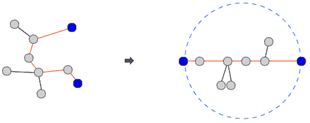

# ch27-29 - 백준 문제 풀이

by | 이혜민
pub date | 2021.02.27.Sat

## 그래프의 깊이 우선 탐색, 너비 우선 탐색


- 깊이 우선 탐색 : 주로 재귀 호출로 구현
- 너비 우선 탐색 : 주로 `queue`를 활용하여 구현

### BOJ 2606 (바이러스)

#### 문제

신종 바이러스인 웜 바이러스는 네트워크를 통해 전파된다. 한 컴퓨터가 웜 바이러스에 걸리면 그 컴퓨터와 네트워크 상에서 연결되어 있는 모든 컴퓨터는 웜 바이러스에 걸리게 된다.

예를 들어 7대의 컴퓨터가 네트워크 상에서 연결되어 있다고 하자. 1번 컴퓨터가 웜 바이러스에 걸리면 웜 바이러스는 2번과 5번 컴퓨터를 거쳐 3번과 6번 컴퓨터까지 전파되어 2, 3, 5, 6 네 대의 컴퓨터는 웜 바이러스에 걸리게 된다. 하지만 4번과 7번 컴퓨터는 1번 컴퓨터와 네트워크상에서 연결되어 있지 않기 때문에 영향을 받지 않는다.

어느 날 1번 컴퓨터가 웜 바이러스에 걸렸다. 컴퓨터의 수와 네트워크 상에서 서로 연결되어 있는 정보가 주어질 때, 1번 컴퓨터를 통해 웜 바이러스에 걸리게 되는 컴퓨터의 수를 출력하는 프로그램을 작성하시오.

#### 입력

첫째 줄에는 컴퓨터의 수가 주어진다. 컴퓨터의 수는 100 이하이고 각 컴퓨터에는 1번 부터 차례대로 번호가 매겨진다. 둘째 줄에는 네트워크 상에서 직접 연결되어 있는 컴퓨터 쌍의 수가 주어진다. 이어서 그 수만큼 한 줄에 한 쌍씩 네트워크 상에서 직접 연결되어 있는 컴퓨터의 번호 쌍이 주어진다.

#### 출력

1번 컴퓨터가 웜 바이러스에 걸렸을 때, 1번 컴퓨터를 통해 웜 바이러스에 걸리게 되는 컴퓨터의 수를 첫째 줄에 출력한다.

#### 풀이

- 루트 컴퓨터(1번 컴퓨터)부터 깊이 우선 탐색하여 연결된 컴퓨터의 수를 카운트

```cpp
#include <iostream>
#include <cmath>
#include <algorithm>
#include <string.h>
#include <vector>
#include <stdio.h>

using namespace std;

int connected[101][101];
int visited[101];
int virusCount = 0;

void dfs(int here, int toVisit) {
    // 이 컴퓨터 방문하고 카운트
    visited[here] = 1;
    virusCount++;
    // 이 컴퓨터와 연결되고, 아직 방문되지 않은 컴퓨터 모두 방문
    for (int i = 1; i <= toVisit; i++) {
        if (connected[here][i] && !visited[i]) {
            dfs(i, toVisit);
        }
    }
    return;
}

int main() {
    memset(connected,0,sizeof(connected));
    memset(visited,0,sizeof(visited));

    int totalComputers, connectedComputers, first, second;
    cin >> totalComputers >> connectedComputers;

    for (int i = 0; i < connectedComputers; i++) {
        cin >> first >> second;
        connected[first][second] = 1;
        connected[second][first] = 1;
    }
    dfs(1, totalComputers);
    cout << virusCount - 1 << endl;
}
```

#### BOJ 1967 (트리의 지름)

#### 문제

트리(tree)는 사이클이 없는 무방향 그래프이다. 트리에서는 어떤 두 노드를 선택해도 둘 사이에 경로가 항상 하나만 존재하게 된다. 트리에서 어떤 두 노드를 선택해서 양쪽으로 쫙 당길 때, 가장 길게 늘어나는 경우가 있을 것이다. 이럴 때 트리의 모든 노드들은 이 두 노드를 지름의 끝 점으로 하는 원 안에 들어가게 된다.



이런 두 노드 사이의 경로의 길이를 트리의 지름이라고 한다. 정확히 정의하자면 트리에 존재하는 모든 경로들 중에서 가장 긴 것의 길이를 말한다.

입력으로 루트가 있는 트리를 가중치가 있는 간선들로 줄 때, 트리의 지름을 구해서 출력하는 프로그램을 작성하시오. 아래와 같은 트리가 주어진다면 트리의 지름은 45가 된다.


트리의 노드는 1부터 n까지 번호가 매겨져 있다.

#### 입력

파일의 첫 번째 줄은 노드의 개수 n(1 ≤ n ≤ 10,000)이다. 둘째 줄부터 n-1개의 줄에 각 간선에 대한 정보가 들어온다. 간선에 대한 정보는 세 개의 정수로 이루어져 있다. 첫 번째 정수는 간선이 연결하는 두 노드 중 부모 노드의 번호를 나타내고, 두 번째 정수는 자식 노드를, 세 번째 정수는 간선의 가중치를 나타낸다. 간선에 대한 정보는 부모 노드의 번호가 작은 것이 먼저 입력되고, 부모 노드의 번호가 같으면 자식 노드의 번호가 작은 것이 먼저 입력된다. 루트 노드의 번호는 항상 1이라고 가정하며, 간선의 가중치는 100보다 크지 않은 양의 정수이다.

#### 출력

첫째 줄에 트리의 지름을 출력한다.

#### 풀이

- 루트에서 깊이 우선 탐색을 통해 가장 멀리 떨어져있는 노드 찾기
- 루트에서 가장 먼 노드를 지름의 시작점으로 지정
- 지름의 시작점에서 깊이 우선 탐색을 통해 가장 멀리 떨어져있는 노드 찾기(지름의 끝점)

```cpp
#include <iostream>
#include <string.h>
#include <vector>
using namespace std;

int nodes;
int visited[10002] = {0};
vector<pair<int,int>> node[10002];

int diameterLength = 0;
int diameterStart = 0;

void dfs(int here,int currentLength){
    // 이미 방문했으면 리턴
    if(visited[here]) return;

    // 아니면 방문하고 지름 갱신
    visited[here] = 1;
    if (diameterLength < currentLength) {
        diameterLength = currentLength;
        diameterStart = here;
    }

    // 연결된 모든 점 방문
    for (int i = 0; i < node[here].size(); i++){
        dfs(node[here][i].first, currentLength + node[here][i].second);
    }
}

int main() {
    cin >> nodes;

    int parent, child, length;
    for (int i = 0; i < nodes - 1; i++){
        cin >> parent >> child >> length;
        node[parent].push_back(make_pair(child,length));
        node[child].push_back(make_pair(parent,length));
    }

    // 루트에서 가장 멀리 떨어진 점 (지름의 시작점)
    dfs(1,0);

    // 지름 길이와 방문 다시 초기화
    diameterLength = 0;
    memset(visited, 0, sizeof(visited));

    // 지름의 시작점에서 가장 멀리 떨어진 점 (지름의 끝점)
    dfs(diameterStart, 0);
    cout << diameterLength << endl;

}

```

#### BOJ 1697 (숨바꼭질)

#### 문제

수빈이는 동생과 숨바꼭질을 하고 있다. 수빈이는 현재 점 N(0 ≤ N ≤ 100,000)에 있고, 동생은 점 K(0 ≤ K ≤ 100,000)에 있다. 수빈이는 걷거나 순간이동을 할 수 있다. 만약, 수빈이의 위치가 X일 때 걷는다면 1초 후에 X-1 또는 X+1로 이동하게 된다. 순간이동을 하는 경우에는 1초 후에 2\*X의 위치로 이동하게 된다.

수빈이와 동생의 위치가 주어졌을 때, 수빈이가 동생을 찾을 수 있는 가장 빠른 시간이 몇 초 후인지 구하는 프로그램을 작성하시오.

#### 입력

첫 번째 줄에 수빈이가 있는 위치 N과 동생이 있는 위치 K가 주어진다. N과 K는 정수이다.

#### 출력

수빈이가 동생을 찾는 가장 빠른 시간을 출력한다.

#### 풀이

- `dfs`는 최소 길이, 최소 거리와 같은 최소 경로를 구하는 데 있어서는 비효율적이기 때문에 `bfs`로 구현
- 탐색할 점들을 `queue`에 넣어두고 하나씩 빼가며 탐색

```cpp
#include <iostream>
#include <vector>
#include <queue>

using namespace std;

bool visited[100001];

int main() {
    int subin, sister;
    int shortestTime = 0;

    cin >> subin >> sister;
    queue< pair<int, int> > q;
    q.push(make_pair(subin, 0));

    while (!q.empty()) {
        int here = q.front().first;
        int currentTime = q.front().second;
        q.pop();

        // 동생 찾았으면
        if (here == sister) {
            shortestTime = currentTime;
            break;
        }

        int back = here - 1;
        int front = here + 1;
        int jump = here * 2;

        // 점의 범위를 벗어나지 않고 방문한 적 없으면
        if (0 <= back && !visited[back]) {
            visited[back] = true;
            q.push(make_pair(back, currentTime + 1));
        }

        // 점의 범위를 벗어나지 않고 방문한 적 없으면
        if (front <= sister && !visited[front]) {
            visited[front] = true;
            q.push(make_pair(front, currentTime + 1));
        }

        // 너무 멀리 점프되지 않게 목표점 + 1까지만 상한을 정해둔 듯
        if (jump <= sister + 1 && !visited[jump]) {
            visited[jump] = true;
            q.push(make_pair(jump, currentTime + 1));
        }
    }

    cout << shortestTime << endl;
    return 0;
}
```

#### BOJ 1202 (보석 도둑)

#### 문제

세계적인 도둑 상덕이는 보석점을 털기로 결심했다.

상덕이가 털 보석점에는 보석이 총 N개 있다. 각 보석은 무게 Mi와 가격 Vi를 가지고 있다. 상덕이는 가방을 K개 가지고 있고, 각 가방에 담을 수 있는 최대 무게는 Ci이다. 가방에는 최대 한 개의 보석만 넣을 수 있다.

상덕이가 훔칠 수 있는 보석의 최대 가격을 구하는 프로그램을 작성하시오.

#### 입력

첫째 줄에 N과 K가 주어진다. (1 ≤ N, K ≤ 300,000)

다음 N개 줄에는 각 보석의 정보 Mi와 Vi가 주어진다. (0 ≤ Mi, Vi ≤ 1,000,000)

다음 K개 줄에는 가방에 담을 수 있는 최대 무게 Ci가 주어진다. (1 ≤ Ci ≤ 100,000,000)

모든 숫자는 양의 정수이다.

#### 출력

첫째 줄에 상덕이가 훔칠 수 있는 보석 가격의 합의 최댓값을 출력한다.

#### 풀이

- 보석의 무게, 가방의 수용무게 오름차순으로 정렬한 후
- 가장 가벼운 가방부터 넣을 수 있는 모든 보석을 `priority queue`에 담고
- 하나의 가방에 대해 `pq`에서 가장 비싼 보석(루트)를 최종적으로 담음
- 그 다음 가방 순서가 되어도 `pq`에 남아있는 보석들은 모두 담을 수 있는 무게이므로 문제 없음


```cpp
#include <iostream>
#include <vector>
#include <queue>
#include <algorithm>

using namespace std;

int totalJewels, totalBags;
int bag[300001];
pair<int, int> jewelry[300001];
priority_queue<int> pq;

int main() {
    cin >> totalJewels >> totalBags;
    // 보석 정보 입력 (무게, 가격)
    for (int i = 0; i < totalJewels; i++) {
        cin >> jewelry[i].first >> jewelry[i].second;
    }
    // 가방 정보 입력
    for (int i = 0; i < totalBags; i++) {
        cin >> bag[i];
    }

    // 보석의 무게와 가방 최대수용무게 오름차순 정렬
    sort(jewelry, jewelry + totalJewels);
    sort(bag, bag + totalBags);

    long result = 0;
    int currentJewel = 0;

    // 가벼운 가방부터 비싼 보석 넣음
    for (int i = 0; i < totalBags; i++) {
        // i번째 가방에 넣을 수 있는 (제한보다 가벼운) 보석 전부 push
        while (currentJewel < totalJewels && jewelry[currentJewel].first <= bag[i]) {
            pq.push(jewelry[currentJewel++].second);
        }

        // pq에 push하면 가격 순으로 정렬된다
        // 하나의 가방에는 하나의 보석만 담을 수 있으므로 가장 비싼 보석만 최종으로 담음
        if (!pq.empty()) {
            result += pq.top();
            pq.pop();
        }
    }

    cout << result << endl;
}
```
